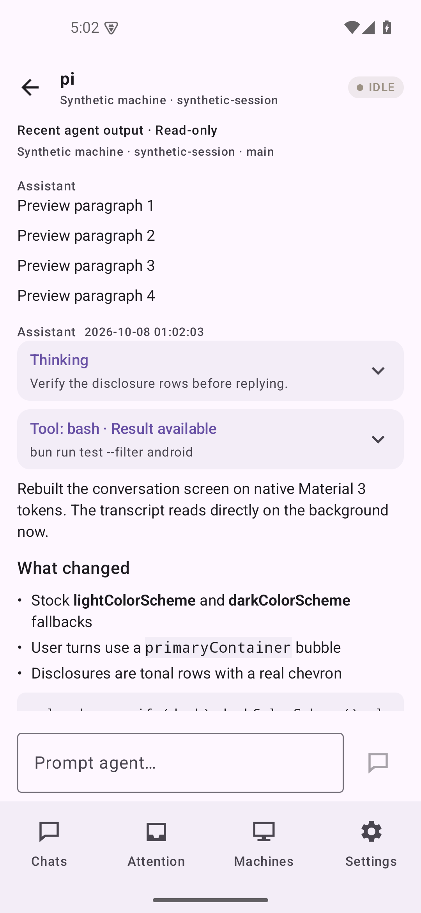
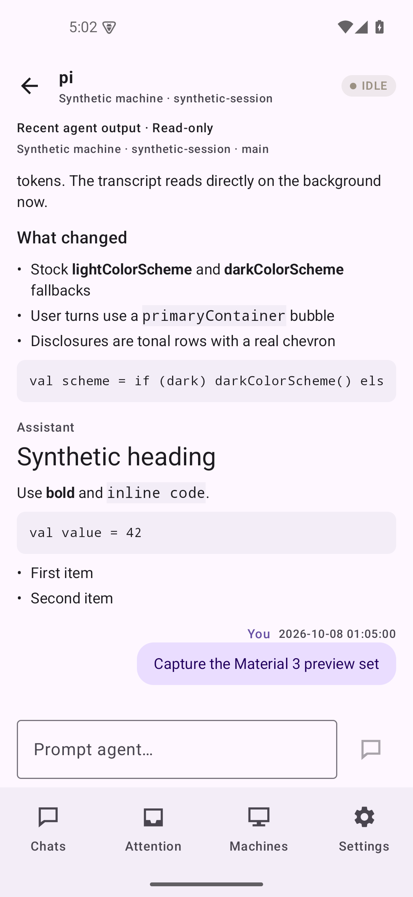
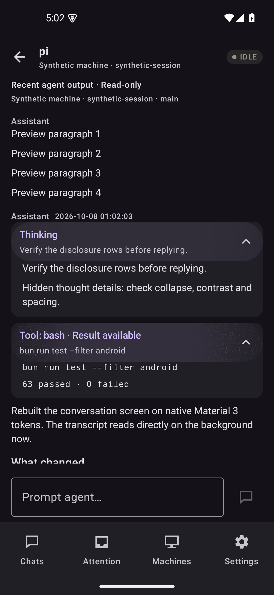
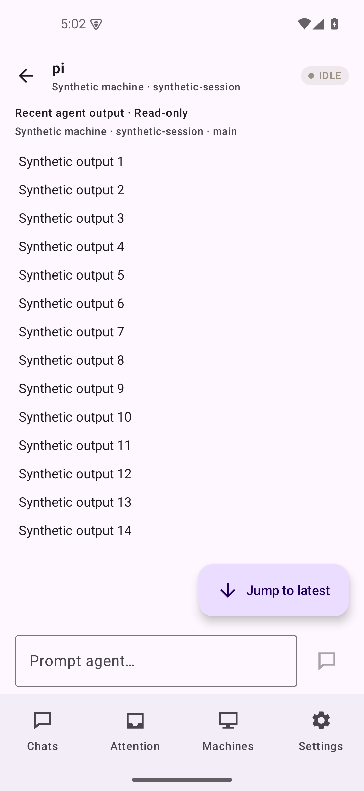
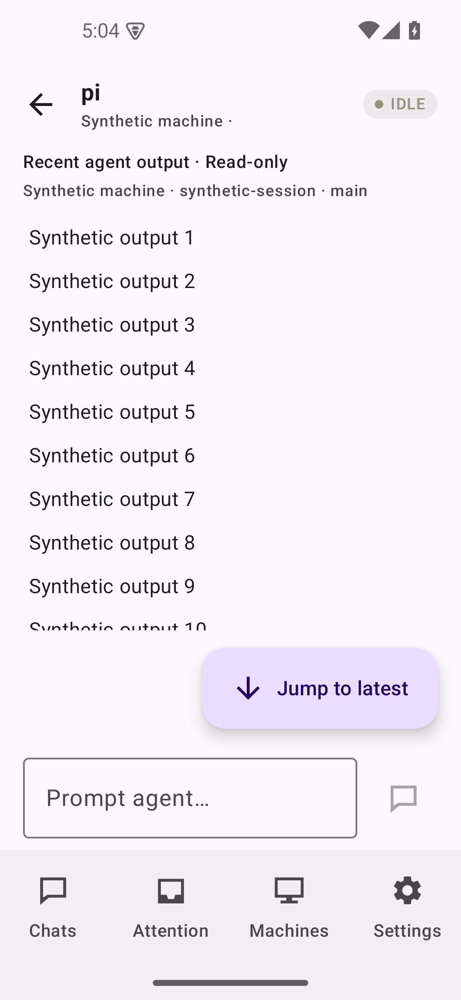
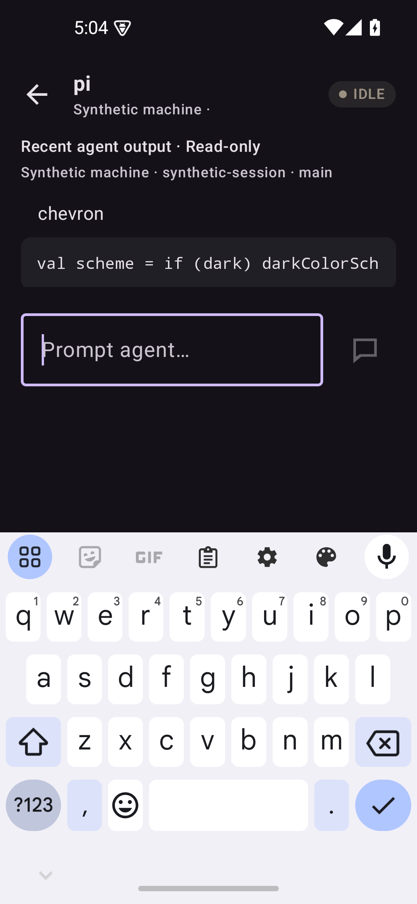
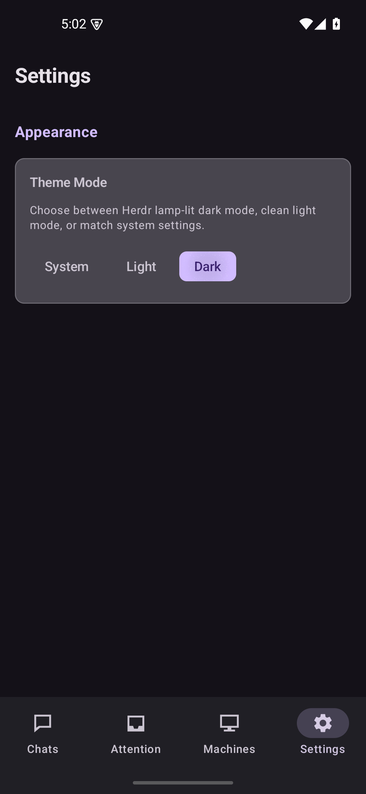

# Native Material 3 conversation slice — owner-approved conversation evidence

Status: **accepted for the conversation slice only** — the owner explicitly approved
this exact 7-image preview set on 2026-10-08. This is not approval of a broader
redesign, a merge, a deployment, or any live/physical acceptance.

Synthetic task-emulator screenshots captured on the task-owned API 35 emulator
(`cappuccino-material3-preview-api35`, `emulator-5560`, Pixel 5 frame, physical
density 440; the 320 dp run used a temporary `wm density 540` override, reset and
verified afterward). Captured via `uiAutomation.takeScreenshot()`, full-frame
1080 × 2340. All fixtures are synthetic; no real transcripts, owner sessions, tokens,
private addresses, physical-device captures or deployment output. Original pixels are
preserved byte-for-byte — no cropping, retouching or optimization; every file is
byte-identical (`cmp`) to its reviewed capture, which was captured on the same
reviewed content later committed as `cc898ef6f8bd58dcd875ef1503f282e523c1781b` on
`feat/android-material3-redesign` (base `36f3afe`, merged PR #28). The images were
captured before that commit; the commit is the frozen source revision, not a runtime
HEAD claim.

Both prior review findings are fixed and independently rechecked (fresh reviewer,
GLM flash, low reasoning): forced 63 JVM tests and 21 instrumented tests, zero
failures/errors/skips; `make validate-android`, `make md-check`, `git diff --check`
all exit 0 — finding 1 (jump FAB bottom geometry) and finding 2 (theme → system-bar
appearance sync) both PASS on source, tests and runtime captures.

## Conversation screen, 393 dp (normal width)

Top of transcript with collapsed disclosures:

_Light theme, disclosures collapsed: tonal "Thinking" / "Tool" disclosure rows with
down chevrons, metadata lines, no decorative borders._

Markdown turn and user bubble:

_Light theme: heading, bold, inline code, fenced block and bullet list; end-aligned,
content-hugging `primaryContainer` user bubble (no fraction-width fill)._

Expanded disclosures, dark scheme:

_Dark app theme (system light): full thought paragraph and monospace tool result
expanded, with **light status-bar clock/icons readable on the dark background** —
the finding-2 fix in the conversation screen._

Follow-latest affordance:

_Light theme, reader detached: "Jump to latest" extended FAB at the bottom end,
right-aligned, directly above the composer — the finding-1 fix at normal width; no
overlap with transcript, composer or navigation._

## Compact width, 320 dp

Follow-latest at compact width:

_Light theme at 320 dp: the same bottom-end FAB placement holds at compact width._

Composer with the keyboard open:

_Dark theme at 320 dp, composer focused with the **IME genuinely open (Gboard
visible in frame)**: composer fully visible above the keyboard; light status icons
on dark. This is the set's only IME-evidence frame — see limits._

## Production theme path (incidental capture)

_Dark app theme while the system is light, on the real production `MainActivity`
composition: the Settings screen with the "Dark" chip selected through the real
Settings journey, showing light status-bar icons on the dark scheme. This frame
evidences the shared theme/status-bar sync only (via the production Settings
status path, incidental to this slice); it is **not** a Settings redesign, and the
Settings layout is out of scope for the accepted slice._

## Integrity

All 7 files are valid PNG, `image/png`, 1080 × 2340 px, byte-identical (`cmp`, exit 0)
to the reviewed originals in the repair scratch; SHA-256 below.

| File | SHA-256 | Dimensions | Bytes |
| --- | --- | --- | --- |
| AppDarkSystemLightLightStatusIcons.png | `fc04191fc69a1f37f08e45857d7e574cd843f185b23d43607de743502001dedb` | 1080 × 2340 | 90 499 |
| Conversation320DarkComposerIme.png | `f3a2e269e866cc62a63b115892002f660fa09e47e0348aec19b4f8e4094911df` | 1080 × 2340 | 155 678 |
| Conversation320LightFollowLatest.png | `f8afbb1b9e7c18c4f0359dd0084f4aacc3efb8d181a3eec3407dd3398959abd2` | 1080 × 2340 | 176 182 |
| Conversation393DarkExpanded.png | `cb9a44bd58c3814bdab2f323f798aa5e39807a3beab6b22b30134b0a8ab96102` | 1080 × 2340 | 258 542 |
| Conversation393LightCollapsed.png | `5ef4b27c5e3be06d76a5052e76e97ef3af412f73599f556b17ba5adcd74d9fff` | 1080 × 2340 | 230 055 |
| Conversation393LightFollowLatest.png | `a7b9966d1e0f680532a90786cc56a1993c1cd5cc060c22871c45356629808b8f` | 1080 × 2340 | 186 575 |
| Conversation393LightMarkdownUserTurn.png | `fe969601dd86ce5468260e31d0fb954b213de0aa49f37580ba98b9349d65eda3` | 1080 × 2340 | 213 252 |

Total: 1 310 783 bytes across the 7 PNGs.

Effective densities: the 393 dp frames ran at physical density 440; the 320 dp frames
used the temporary 540 override (dp values are from the live display metrics at
capture time). Frame prefixes (`Conversation393…` / `Conversation320…`) are unchanged
from capture. Related prior evidence: [conversation polish (PR #28)](../conversation-polish/README.md).

## Limitations

- Synthetic emulator fixtures only: not live Pi parity, not an active-branch or
  physical-device capture, not a deployment or end-to-end bridge result.
- The compact 320 dp frames use a temporary density override, not a different device.
- Some 393 dp composer frames in the broader candidate set assert IME insets only,
  with no keyboard visible in frame (recurring headless-IME flake); those are
  excluded here. The included 320 dp IME frame is the genuine visible-keyboard
  evidence.
- `AppDarkSystemLightLightStatusIcons.png` shows the production Settings status path
  only as incidental evidence of the shared palette/sync; it does not evidence a
  Settings redesign.
- Other screens share the stock M3 color tokens (their colors changed) but their
  layouts are not restyled and remain out of scope for the accepted slice.
- Static screenshots cannot prove all behavior; dynamic test coverage (63 forced JVM
  and 21 instrumented tests, independently rerun) carries that.
