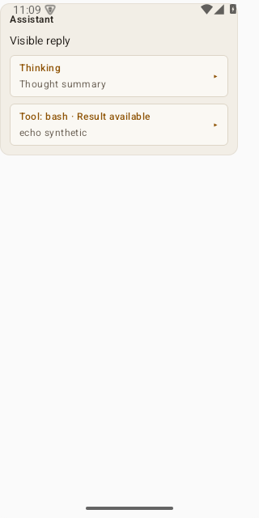
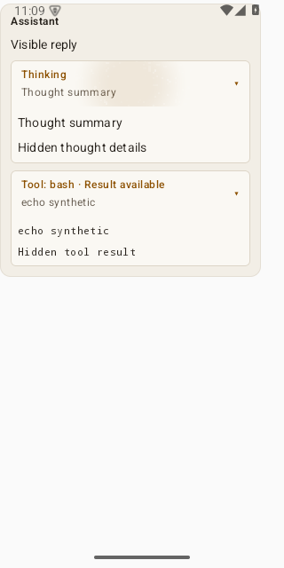
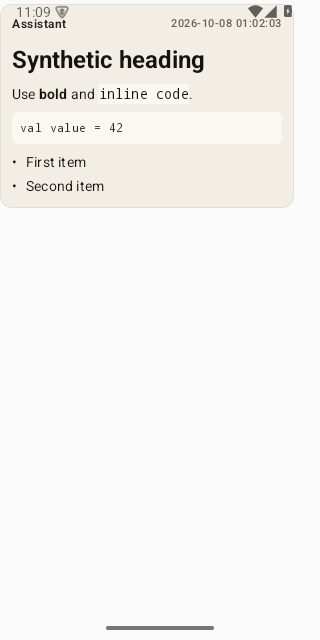
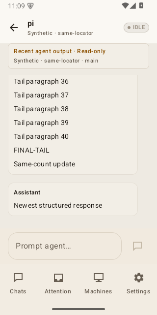
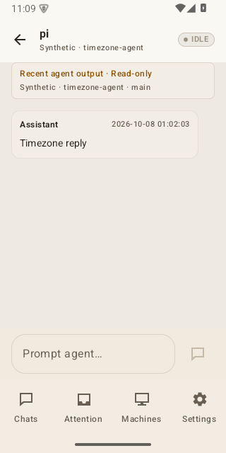

# Conversation polish — acceptance evidence (PR #28)

Synthetic task-emulator screenshots captured on the task-owned API 35 emulator
(`cappuccino-conversation-polish-api35 (AVD) - 15`). All fixtures are synthetic;
no real transcripts, personal content, physical-device captures or deployment
output. Source revision: `b5ac1e6` (`fix/conversation-polish`), independently
verified at runtime-equivalent `c3113bc` + working diff with 63 JVM tests (forced) and 13 instrumentation tests, with no failures, errors or skips. Original pixels are preserved
byte-for-byte; hashes below.

Collapsed and expanded states of an assistant reply containing a thinking
section and a `bash` tool call, rendered from synthetic fixtures:

_Collapsed: thinking and tool sections shown as compact "Thought summary" /
"Tool: bash · Result available" cards._

_Expanded: the same reply with hidden thought details and tool result visible._

Markdown rendering of an assistant reply:

_Synthetic heading, bold, inline code, a code block (`val value = 42`) and a
bullet list rendered as rich content._

Tail-tracking after a same-count update:

_After 40 tail paragraphs plus "FINAL-TAIL", a same-count update and
jump-to-latest leave the view at the true bottom of the tall turn, showing the
newest structured reply._

Reply timestamp after a device timezone change:

_With the device timezone changed, the assistant reply timestamp renders as
`2026-10-08 01:02:03` in the new zone._

## Integrity

All files are valid PNG, `image/png`, 320 × 640 px, byte-identical to their
original emulator output.

| File | SHA-256 | Dimensions | Bytes |
| --- | --- | --- | --- |
| ConversationCollapsed.png | `df9aea1229c246d46dac0202161b766ed2a3986c1ee6c25b592a7ae1ee0557c4` | 320 × 640 | 12 703 |
| ConversationExpanded.png | `bc37b478616f4264493a22195fb4f07eb516151683f40908670419b64f184902` | 320 × 640 | 20 033 |
| ConversationMarkdown.png | `a63438834b755e3215729c58ad0c3077036d043f21543ef48ae339c1226583f6` | 320 × 640 | 15 465 |
| ConversationLatest.png | `044580cb250f7a2f7af958a8faad5ff3c38ceb039c1214d2ab8c5ebe83b937f3` | 320 × 640 | 30 488 |
| DeviceTimezoneChanged.png | `b09027a69a49ac2400640ef509c094f31de568962b628aedab01bf63bee81efe` | 320 × 640 | 22 948 |

Total: 101 637 bytes (~99.3 KiB) across the 5 PNGs.

## Limitations

- Not live Pi parity: the agent output shown is synthetic fixture content.
- Not a physical-device capture; emulator only.
- Not a deployment or end-to-end bridge result.
